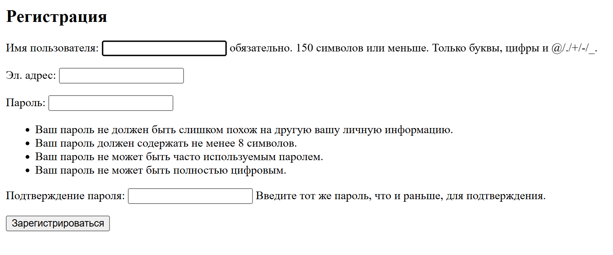
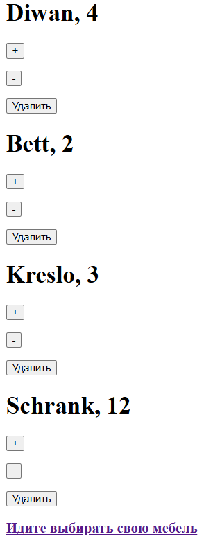

# Интернет-магазин на Джанго
Учебный проект, созданный на Джанго, имитирующий работу магазина
## Возможности сайта
- Просмотр товаров
- Добавление товаров в корзину
- Удаление товаров из корзины
- Изиенение количества товаров корзины
- Регистрация, вход и выход
- Просмотр и изменение профиля
## Чему научился 
- Связь многие ко многим в базе данных 
- Регистрация пользователя и изменение его данных с помощью встроенных форм
- Хранение картинок в базе данных
- Подключение статических файлов
## Работа сайта 
### Главная страница

### Карта товара

### Регистрация

### Изменение профиля

### Корзина
